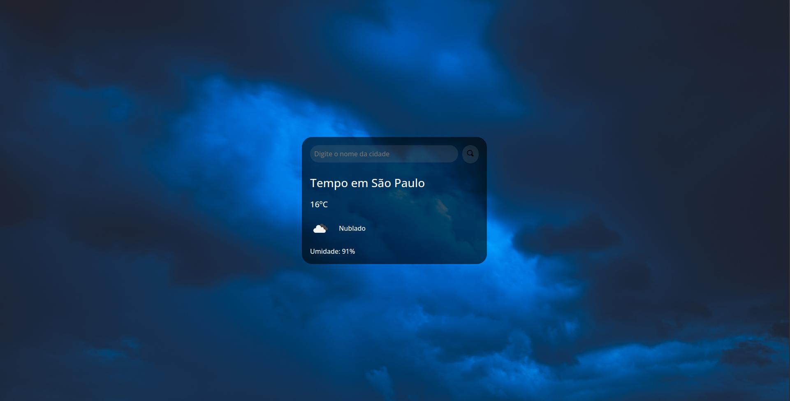

<h1 align="center"> Previsão do tempo </h1>

Programa exclusivo e gratuito, desenvolvido como fonte de estudos.

  <a href="#-tecnologias">Tecnologias</a>&nbsp;&nbsp;&nbsp;|&nbsp;&nbsp;&nbsp;
  <a href="#-projeto">Projeto</a>&nbsp;&nbsp;&nbsp;&nbsp;&nbsp;&nbsp;

 

  

## 🚀 Tecnologias

Esse projeto foi desenvolvido com as seguintes tecnologias:

- HTML e CSS
- JavaScript
- Git e Github
- Consumo de API

## 💻 Projeto

O projeto de Previsão do tempo é, inicialmente, uma aplicação em que você digita o nome da cidade desejada e consegue obter os dados atuais de tempo e umidade, aproveitando a bela exibição dos planos de fundo interativos, que mudam conforme a condição climática da cidade escolhida. Foram aplicados efeitos de transição de contraste ao posicionar o ponteiro sobre alguns componentes específicos, além da possibilidade de poder escolher entre tema claro e escuro. A ideia é futuramente implementar mais funções e aprimorar os recursos já existentes.

---

Feito com ♥ by Bruno Oliveira :wave: [Descubra a inspiração para esse projeto!](https://www.youtube.com/watch?v=qxzqEuAOYZ4)
